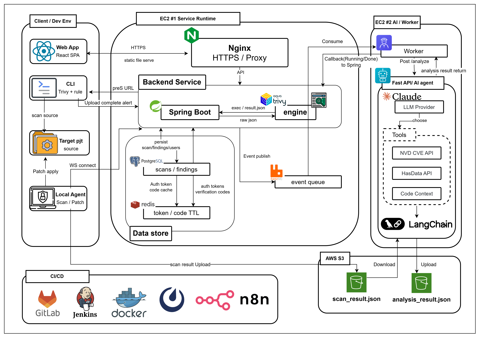

# 🛡️ SSAfer

> **당신의 코드가 세상에 안전하게 닿도록.**

**SSAfer**는 프로젝트의 Docker · 환경 변수 · 서버 설정 같은 인프라 보안 취약점을 결정론적으로 탐지하고, AI가 사람이 이해할 수 있는 설명과 수정안으로 변환한 뒤, 사용자가 승인하면 Local Agent가 실제 파일을 안전하게 수정하는 작업형 보안 코파일럿입니다.

> _"1명이 없어도, 6명 모두가 안전하도록."_  
> 결정론적 탐지 + 마스킹 + 구조화된 프롬프트 = 재현 가능한 보안 조언

- 개발 기간 : 2026.04.06 ~ 2026.05.22 (7주)
- 플랫폼 : Web (CLI 동반)
- 개발 인원 : 6명
- 기관 : 삼성 청년 SW·AI 아카데미 14기


---

## 🚀 핵심 기능

### 🔍 결정론적 탐지 엔진
- **Custom Rule + Trivy 책임 분리**: Dockerfile은 Trivy 공식 룰에 맡기고, Compose · `.env` · 포트 노출 · 볼륨 마운트는 SSAfer 자체 룰 엔진이 전담합니다. LLM은 탐지가 아니라 해석만 담당해 가짜 취약점이 구조적으로 생기지 않습니다.
- **버전 관리되는 룰셋**: 탐지 기준이 팀 전체에 동일하게 적용되며, LLM 세션마다 결과가 달라지지 않습니다.

### 🤖 AI 분석 파이프라인 — 컴퓨터의 언어를, 사람의 언어로
- **Agent Gate**: CVE 또는 HIGH/CRITICAL인 finding에만 LangGraph 기반 Tool-calling Agent가 동작하여 LLM 비용을 최소화합니다.
- **3개 Tool**: NVD CVE 조회, 코드 컨텍스트 추출, HasData SERP 웹 검색을 통해 근거를 수집한 뒤 Explain → Fix → Verify 체인으로 설명과 수정안을 생성합니다.
- **멀티 LLM 프로바이더**: `LLM_PROVIDER` 환경변수로 Anthropic Claude / Ollama / GMS를 런타임에 전환할 수 있으며, GMS provider는 내부적으로 OpenAI-compatible endpoint도 지원합니다.

### 🔐 마스킹 레이어
- **로컬 마스킹**: CLI는 업로드 전에 `.env` 원본 값 · API 키 · Private Key를 마스킹합니다. 원본 값은 외부 LLM으로 절대 전송되지 않습니다.
- **컴플라이언스 친화**: 팀/기업 환경에서 Cursor 같은 범용 AI 코딩 도구를 쓸 수 없는 상황을 커버합니다.

### 🔧 Agent 기반 안전한 자동 수정
- **patchContext 계약**: CLI가 `oldText` · `expectedFileHash`를 제공하고 AI는 `newText`만 생성합니다. 웹은 승인만 담당하고 실제 파일 수정은 Local Agent가 백업 후 수행합니다.
- **이력 추적**: `scanId`로 프로젝트의 보안 상태 변화를 시계열로 비교할 수 있습니다.

---

## 🧩 서비스 기능 소개

### Core Features

<table>
  <tr>
    <th width="33%">웹 업로드 체험</th>
    <th width="33%">CLI 풀스캔</th>
    <th width="33%">Agent 패치 승인</th>
  </tr>
  <tr>
    <td align="center">
      
    </td>
    <td align="center">
      
    </td>
    <td align="center">
      
    </td>
  </tr>
  <tr>
    <td>docker-compose.yml과 .env 파일을 드래그앤드롭하면 10초 안에 취약점과 AI 설명을 확인할 수 있습니다.</td>
    <td><code>pip install ssafer</code> 후 <code>ssafer run --upload</code>로 전체 프로젝트를 스캔하고 결과를 웹에서 확인합니다.</td>
    <td>웹에서 수정안을 검토하고 승인하면 Local Agent가 백업 후 실제 파일을 안전하게 수정합니다.</td>
  </tr>
</table>

### Additional Features

<table>
  <tr>
    <th width="33%">서버 런타임 점검</th>
    <th width="33%">히스토리 비교</th>
    <th width="33%">Guest 체험 모드</th>
  </tr>
  <tr>
    <td align="center">
      
    </td>
    <td align="center">
      
    </td>
    <td align="center">
      
    </td>
  </tr>
  <tr>
    <td>EC2 등 운영 서버에서 <code>ssafer server</code>로 열린 포트 · SSH 설정 · 방화벽 · OS 패키지 취약점까지 점검합니다.</td>
    <td>이전 스캔 대비 신규 / 해결 / 유지 / 심각도 변경된 항목을 분리해 변화량을 한눈에 확인합니다.</td>
    <td>회원가입 없이 Guest 토큰으로 웹과 CLI를 즉시 연결해 서비스를 체험할 수 있습니다.</td>
  </tr>
</table>

---

## 🛠 핵심 기술

### 🔄 비동기 분석 파이프라인
- **RabbitMQ + AI Worker**: Spring이 HTTP 동기 호출 대신 RabbitMQ로 작업을 dispatch하고, AI Worker가 consume → FastAPI 호출 → 콜백하는 구조로 분석 시간(10~60초)이 길어도 커넥션 점유 문제가 없습니다.
- **재시도 정책 정교화**: 409 Conflict 등 영구 에러는 `requeue=False`, timeout · 5xx만 `requeue=True`로 처리해 무한 재처리 루프를 차단했습니다.

### 📡 실시간 진행 상태 통지
- **폴링 + SSE 이중 구조**: 기본 5초 폴링으로 안정성을 확보하고, SSE 완료 · 실패 이벤트 수신 시 즉시 새로고침을 트리거해 실시간성을 확보했습니다.
- **Raw WebSocket Agent 채널**: Local Agent와 백엔드 사이의 Task 알림은 Spring의 raw WebSocket handler 위에서 자체 정의한 CONNECT / PING / PONG 메시지를 주고받는 방식으로 처리합니다. STOMP/SockJS 같은 상위 프로토콜에 묶이지 않아 Python Agent에서 가볍게 구현할 수 있습니다.

### 🧠 LangGraph 기반 Tool-calling Agent
- **조건부 Agent 호출**: `AGENT_ENABLED && (CVE 존재 || severity ∈ {HIGH, CRITICAL})`일 때만 Agent를 활성화해 LLM 비용을 절감합니다.
- **근거 수집기로서의 Agent**: Agent는 최종 설명을 직접 쓰지 않고 CVE/코드/웹 컨텍스트만 수집해 Explain · Fix Chain의 입력에 추가합니다. 할루시네이션이 최종 출력에 직접 영향을 주지 않는 구조입니다.

### 🧱 ssafer-engine 컨테이너 분리
- **책임 분리**: Spring 컨테이너가 Trivy를 직접 실행하지 않고, FastAPI + Trivy 내장 컨테이너(`ssafer-engine`)가 웹 업로드 스캔을 전담합니다. CLI의 RuleEngine을 그대로 재사용해 CLI ↔ 웹 결과 정합성을 확보했습니다.
- **운영 안전장치**: `X-Internal-Token` 검증, path traversal 방지, 파일 개수 · 용량 제한, non-root user 실행, prod 환경에서 8100 포트 외부 미노출.

### 🔧 patchContext 안전 계약
- **CLI ↔ AI ↔ Agent 3자 계약**: CLI가 `oldText` · `expectedFileHash`를 만들면 AI는 `newText`만 생성하고, Local Agent가 파일 적용 직전 hash를 다시 검증합니다.
- **3중 안전장치**: (1) 사용자 승인, (2) `expectedFileHash` 일치, (3) 백업 파일 생성 후 적용. 프로젝트 루트 밖 파일 접근은 차단됩니다.

---

## 🤖 AI 기술 요약

| 기술 영역 | 요약 |
| --- | --- |
| 결정론적 탐지 | Custom Rule 엔진과 Trivy를 책임 분리하여 룰 기반으로만 finding을 생성합니다. LLM은 절대 새 취약점을 만들어내지 않습니다. |
| LangGraph Agent | LangChain `create_agent` 기반 ReAct 루프로 NVD CVE 조회 · 코드 컨텍스트 추출 · HasData SERP 검색 3개 Tool을 조건부로 호출합니다. |
| 멀티 LLM 프로바이더 | `LLM_PROVIDER` 환경변수로 anthropic / ollama / gms 3종을 런타임에 전환합니다. gms provider는 내부적으로 OpenAI-compatible endpoint도 처리합니다. 운영은 GMS gpt-5-mini로 추가 인프라 비용 0원. |
| 마스킹 우선 | CLI에서 업로드 전 정규식 기반 마스킹을 수행하고, `maskedEvidence`만 LLM에 전달해 `.env` 원본이 외부로 나가지 않습니다. |
| 그룹화 batch 호출 | 같은 `rule_id`의 findings를 묶어 batch 호출하고, 실패 시 단건 fallback. CVE 결과는 `lru_cache`로 메모리 캐싱. |
| 신뢰성 재시도 | `invoke_llm_with_retry`로 세마포어 + 지수 백오프 재시도, Pydantic JSON 스키마 검증, `verify_chain`으로 fix 이중 검증. |
| 자동 수정 안전 계약 | `patchContext`로 CLI가 `oldText` · `expectedFileHash`를 제공하고 AI는 `newText`만 생성하며 Agent가 hash 재검증 후 적용. |
| 컨텍스트 보강 | Agent가 수집한 CVE · 코드 스니펫 · 웹 레퍼런스를 `enriched_context`로 구조화해 Explain · Fix Chain 프롬프트에 주입합니다. |

---

## 🛠 기술 스택

### Frontend

<p align="center">
  
  
  
  
  
  
</p>

| Category | Stack |
| --- | --- |
| Language | TypeScript |
| Framework | React 19 |
| Build Tool | Vite 8 |
| Styling | Tailwind CSS v4 |
| State | Zustand |
| Routing | React Router v7 (BrowserRouter + Routes + Route) |
| Network | Axios (interceptor 기반 토큰 갱신) |
| Real-time | @microsoft/fetch-event-source 기반 SSE |
| IDE | Visual Studio Code |

### Backend

<p align="center">
  
  
  
  
  
  
</p>

| Category | Stack |
| --- | --- |
| Language | Java 21 |
| Framework | Spring Boot 4.0.5 |
| Build Tool | Maven |
| Database | PostgreSQL (JPA + Flyway 마이그레이션) |
| Cache / Session | Redis |
| Messaging | Spring AMQP (RabbitMQ) |
| Real-time | Raw WebSocket Handler (Agent 채널, CONNECT / PING / PONG 자체 정의) + SSE (프론트 통지) |
| Security | Spring Security, JWT (jjwt), OAuth2 (Google / GitHub) |
| Scheduler | `@Scheduled` 기반 `WorkerJobRepublishScheduler` (Spring Batch 미사용) |
| Storage | AWS S3 SDK v2 |
| IDE | IntelliJ IDEA |

### AI

<p align="center">
  
  
  
  
  
</p>

| Category | Stack |
| --- | --- |
| Language | Python 3.11+ |
| Framework | FastAPI + Uvicorn |
| Orchestration | LangChain 1.x + LangGraph (`create_agent`) |
| LLM Providers | `LLM_PROVIDER` 3종: `anthropic` (Claude) / `ollama` (로컬) / `gms` (운영, OpenAI-compatible 포함) |
| Messaging | pika + aio-pika (RabbitMQ consumer) |
| Validation | Pydantic |
| Storage | boto3 (S3) |
| External Tools | NVD CVE API, HasData SERP API |
| Operational | 운영은 GMS gpt-5-mini, 검증은 Claude, 로컬은 Ollama |

### CLI

<p align="center">
  
  
  
  
  
</p>

| Category | Stack |
| --- | --- |
| Language | Python 3.10+ |
| CLI Framework | Typer + Rich |
| Networking | httpx, websockets |
| Validation | Pydantic, PyYAML |
| Packaging | hatchling |
| Distribution | PyPI (`pip install ssafer` / `pipx install ssafer`) |
| Bundled | Trivy 바이너리 자동 다운로드 |

### Engine (웹 업로드 스캔)

<p align="center">
  
  
  
</p>

| Category | Stack |
| --- | --- |
| Language | Python 3.10+ |
| Framework | FastAPI + Uvicorn |
| Scanner | Trivy + Custom Rule Scanner (CLI의 RuleEngine 재사용) |
| Dependency | CLI 패키지(`ssafer.core`, `ssafer.rules`)를 직접 import → CLI와 함께 설치 필요 |
| Isolation | Docker internal network, prod 환경에서 외부 포트 미노출 |
| Security | X-Internal-Token 검증, path traversal 방지, non-root 실행 |

### Infra

<p align="center">
  
  
  
  
  
  
</p>

| Category | Stack |
| --- | --- |
| Compute | AWS Lightsail (EC2 #1: 서비스) + AWS EC2 t3.large (EC2 #2: 분석) |
| Container | Docker, Docker Compose |
| Web Server | Nginx (SSE 패스스루) |
| SSL | Let's Encrypt (Certbot) |
| CI/CD | Jenkins |
| Storage | AWS S3 |
| Monitoring | CloudWatch Logs |
| Domain | k14b105.p.ssafy.io / ssafer.co.kr |

---

## 🏗 시스템 아키텍처



```
[웹 업로드 경로]
브라우저 → Nginx → Spring → ssafer-engine (FastAPI + Trivy) → scan_result.json → S3

[CLI 경로]
로컬 CLI → Trivy + Custom Rule + Masking → scan_result.json → S3 → Spring

[공통 분석 흐름]
Spring → RabbitMQ publish (scan_request)
      → AI Worker consume
      → Spring callback (RUNNING)
      → FastAPI /analyze
      → LangGraph Agent (CVE OR HIGH/CRITICAL일 때만)
            ├─ search_cve (NVD)
            ├─ analyze_code_context
            └─ search_web (HasData)
      → Explain → Fix → Verify Chain
      → analysis_result.json → S3
      → Spring callback (DONE/FAILED)
      → SSE/폴링 → 프론트 결과 페이지 자동 이동

[패치 적용 흐름]
웹: 승인 버튼 → Spring → Raw WebSocket (CONNECT/PING/PONG) → Local Agent
                                                              ↓
                                  Agent: hash 검증 → 백업 → 파일 수정 → patchResults 보고
```

---

## 🚀 시작하기

### 1. Prerequisites
- **Java 21**
- **Python**: AI 서버는 3.11+ 권장, CLI / Engine은 3.10+ 지원
- **Node.js 20+**
- **Docker & Docker Compose**
- **Trivy** (CLI가 자동 설치 시도)

### 2. Local Execution

#### AI Server

```bash
cd AI
pip install -r requirements.txt
uvicorn app.main:app --reload --port 8000
```

#### AI Worker (별도 프로세스)

```bash
cd AI
python -m app.worker.async_consumer
```

#### Backend

```bash
cd Backend/ssafer
./mvnw spring-boot:run
```

#### Engine (웹 업로드 스캔)

> Engine은 단독 패키지로 보이지만 실제로는 CLI 패키지의 `ssafer.core`, `ssafer.rules`를 직접 import합니다.  
> 반드시 CLI 패키지와 함께 editable install 해야 합니다.

```bash
# 저장소 루트에서
pip install -e ./CLI
pip install -e ./Engine

# 실행
cd Engine
uvicorn engine.app:app --port 8100
```

#### Frontend

```bash
cd Frontend
npm install
npm run dev
```

#### CLI

```bash
# 사용자 설치
pip install ssafer
# 또는
pipx install ssafer

# 사용
ssafer login
ssafer run --upload --path ./my-project
ssafer apply
```

---

## 👨‍👩‍👧‍👦 팀 B105 — 모두의 보안

<table>
  <tr>
    <td align="center" width="200">
      
      <br>
      <strong>유동훈 (팀장)</strong>
    </td>
    <td align="center" width="200">
      
      <br>
      <strong>김건남</strong>
    </td>
    <td align="center" width="200">
      
      <br>
      <strong>김태영</strong>
    </td>
    <td align="center" width="200">
      
      <br>
      <strong>양혜지</strong>
    </td>
    <td align="center" width="200">
      
      <br>
      <strong>김승수</strong>
    </td>
    <td align="center" width="200">
      
      <br>
      <strong>김은수</strong>
    </td>
  </tr>
  <tr>
    <td align="center"><sub>팀장</sub></td>
    <td align="center"><sub>백엔드</sub></td>
    <td align="center"><sub>백엔드</sub></td>
    <td align="center"><sub>풀스택</sub></td>
    <td align="center"><sub>CLI</sub></td>
    <td align="center"><sub>인프라</sub></td>
  </tr>
  <tr>
    <td align="center"><sub>프로젝트 총괄, 일정 관리, AI 파이프라인 / Agent 설계</sub></td>
    <td align="center"><sub>스캔 · 결과 API, RabbitMQ 워커 dispatch, SSE 발행, 인증/인가</sub></td>
    <td align="center"><sub>Local Agent Raw WebSocket 채널, 패치 승인 API, 히스토리 비교, JPA 설계</sub></td>
    <td align="center"><sub>전체 프론트엔드 + 일부 백엔드, 결과 탐색 UI, SSE/폴링 구독, 페이지 라우팅 설계</sub></td>
    <td align="center"><sub>CLI 명령어 체계, Custom Rule 엔진, 마스킹 정책, Local Agent, PyPI 배포</sub></td>
    <td align="center"><sub>EC2 2대 분리 구성, Jenkins CI/CD, Nginx + Certbot, ssafer-engine 컨테이너 분리</sub></td>
  </tr>
</table>

---

## 📄 License

This project is licensed under the **MIT License** — see the [LICENSE](./LICENSE) file for details.

> SSAfer의 정적 분석 기능은 오픈소스로 공개되어 있습니다. 코드 사용 · 수정 · 재배포 · 상업적 사용이 자유로우며, 원본 저작권 표시와 MIT 라이선스 문구를 유지하면 됩니다.